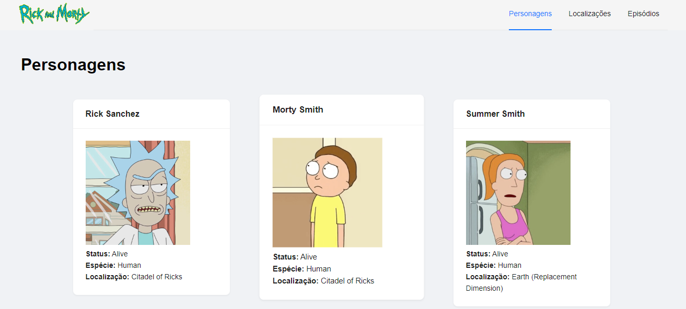
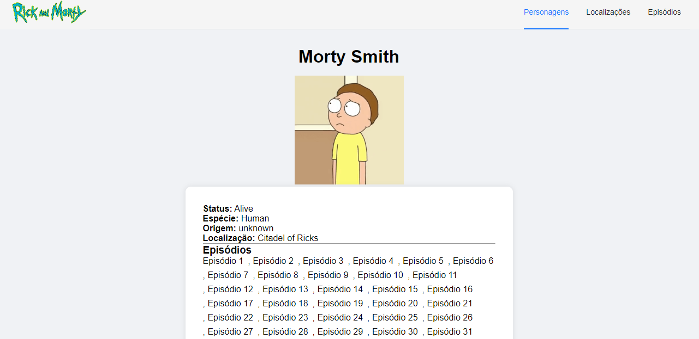
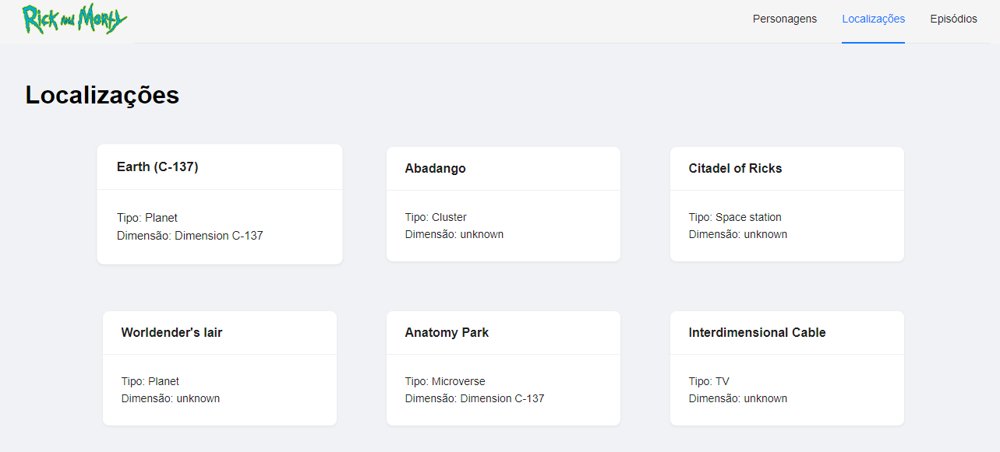
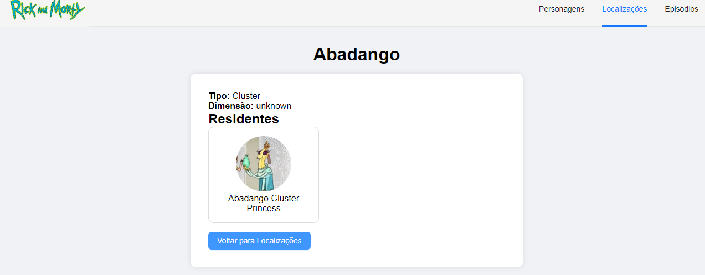
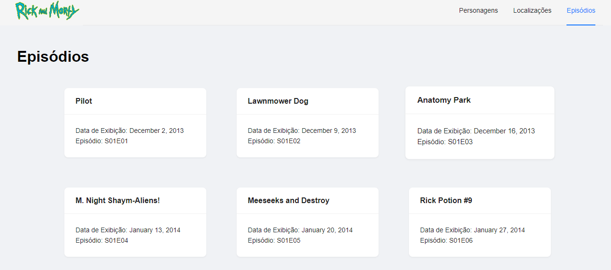
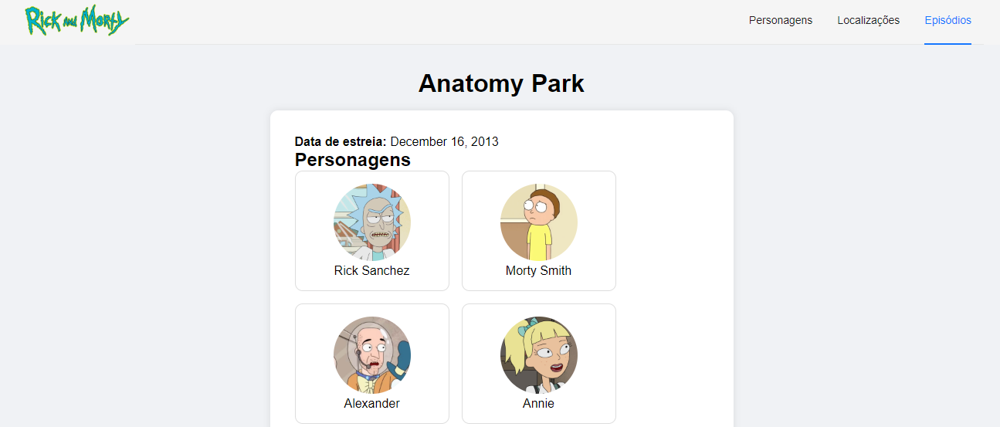
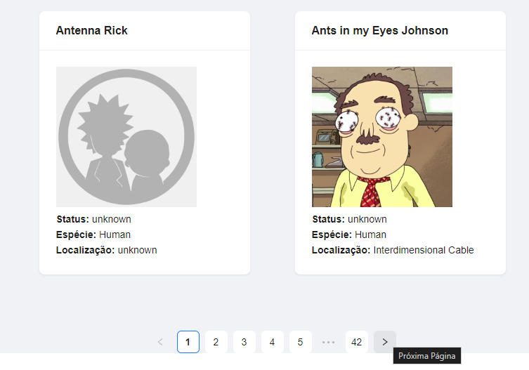

<body>

<h1>Pós-Graduação: Projeto API Rick and Morty com React</h1>

<h2>Sobre o Projeto</h2>

  Este projeto da Pós-graduação em Desenvolvimento Web Full Stack, é uma aplicação web para a disciplina de Arquitetura Front End(Programação Web com linguagem Script)-Pós-graduação,  que exibe informações sobre os personagens, localizações e episódios da série animada "Rick and Morty". 
  Os dados são obtidos a partir da API pública <b><a href="https://rickandmortyapi.com/">Rick and Morty API</a>.</b>
  
<b>Link da API pública Rick and Morty:</b><a href="https://rickandmortyapi.com/"> https://rickandmortyapi.com/</a>
 
  
<b>Link da documentação da API pública Rick and Morty:</b><a href="https://rickandmortyapi.com/documentation/"> https://rickandmortyapi.com/documentation/</a>

<h2>Funcionalidades Implementadas</h2>
<ul>
  <li>Listagem de personagens com paginação.</li>
  <li>Detalhamento de cada personagem, incluindo nome, foto, status, espécie, origem, localização e episódios em que aparecem.</li>
  <li>Listagem de localizações com paginação.</li>
  <li>Detalhamento de cada localização, incluindo nome, tipo, dimensão e residentes.</li>
  <li>Listagem de episódios com paginação.</li>
  <li>Detalhamento de cada episódio, incluindo nome, data de estreia e personagens presentes.</li>
  <li>Navegação entre as páginas usando react-router-dom.</li>
</ul>

<h2>Tecnologias Utilizadas</h2>
<ul>
  <li>Linguagem: TypeScript</li>
  <li>Freamework: React</li>
  <li>Bibliotecas:
    <ul>
      <li>React</li>
      <li>React Router DOM</li>
      <li>Axios (para requisições HTTP)</li>
      <li>React Bootstrap</li>
    </ul>
  </li>
</ul>

<h2>Instalação do Projeto</h2>

Siga as instruções abaixo para configurar e executar o projeto localmente.

<ol>
  <li>Clone o repositório para a sua máquina local.</li>
  <pre><code>git clone https://github.com/felipealx1/Projeto-Rick_Morty-PosGraduacao</code></pre>
  <li>Navegue até o diretório do projeto.</li>
  <pre><code>cd nome-do-repositorio</code></pre>
  <li>Instale as dependências necessárias usando npm.</li>
  <pre><code>npm install</code> ou <code>npm i</code></pre>
  <li>Inicie o servidor de desenvolvimento.</li>
  <pre><code>npm run dev</code></pre>
</ol>

<h2>Imagens do Projeto</h2>

Abaixo estão algumas capturas de tela do projeto em funcionamento:

  
  
  
  
  
  
  

</body>
</html>
